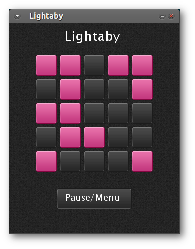

# Lightaby

This is a simple implementation of the [Lights out][1] game where the goal of
the game is to turn off all the lights in the grid. Colored squares signify
light being turned on, and gray squares signify light being turned off. Goal is
to have all squares become gray. You can click on a box to toggle its state, but
doing so will also toggle the state of the vertically and horizontally adjacent
squares.

    [1]: http://en.wikipedia.org/wiki/Lights_Out_(game)

# Licence

Some parts of the code (libraries used, like LOVE, goo, hump) have their own
licences. The game's code, whatever I wrote is distributed with the MIT License.
